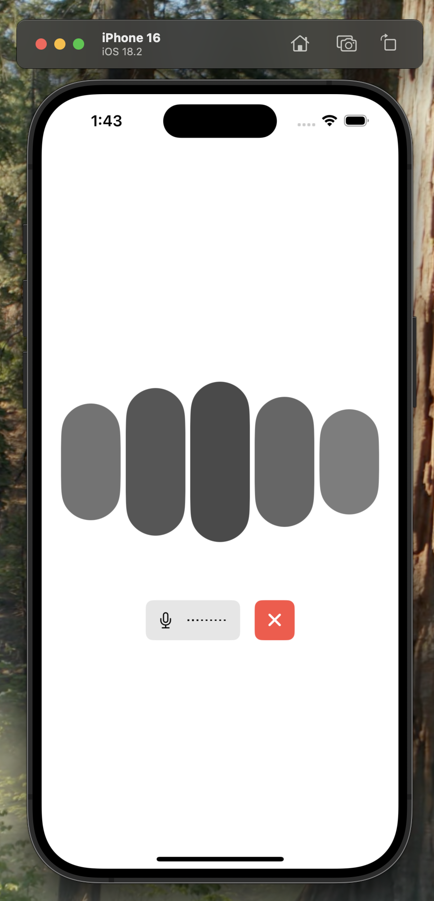

# Swift Voice Assistant

This is a starter template for [LiveKit Agents](https://docs.livekit.io/agents/overview/) that provides a simple voice interface using the [LiveKit Swift SDK](https://github.com/livekit/client-sdk-swift).

This template is comaptible with iOS, iPadOS, macOS, and visionOS and is free for you to use or modify as you see fit.



## Getting started

The easiest way to get this app running is with the [Sandbox for LiveKit Cloud](https://cloud.livekit.io/projects/p_/sandbox) and the [LiveKit CLI](https://docs.livekit.io/home/cli/cli-setup/).

First, create a new [Sandbox Token Server](https://cloud.livekit.io/projects/p_/sandbox/templates/token-server) for your LiveKit Cloud project.

Then, run the following command to automatically clone this template and connect it to LiveKit Cloud.

```bash
lk app create --template voice-assistant-swift --sandbox <token_server_sandbox_id>
```

Built and run the app from Xcode by opening `VoiceAssistant.xcodeproj`. You may need to adjust your app signing settings to run the app on your device.

You'll also need an agent to speak with. Try our sample voice assistant agent for [Python](https://github.com/livekit-examples/voice-pipeline-agent-python), [Node.js](https://github.com/livekit-examples/voice-pipeline-agent-node), or [create your own from scratch](https://docs.livekit.io/agents/quickstart/).

> [!NOTE]
> To setup without the LiveKit CLI, clone the repository and then either create a `VoiceAssistant/.env.xcconfig` with a `LIVEKIT_SANDBOX_ID` (if using a [Sandbox Token Server](https://cloud.livekit.io/projects/p_/sandbox/templates/token-server)), or open `TokenService.swift` and add your [manually generated](#token-generation) URL and token.

## Token generation

In a production environment, you will be responsible for developing a solution to [generate tokens for your users])(https://docs.livekit.io/home/server/generating-tokens/) which is integrated with your authentication solution. You should disable your sandbox token server and modify `TokenService.swift` to use your own token server.

## Contributing

This template is open source and we welcome contributions! Please open a PR or issue through GitHub, and don't forget to join us in the [LiveKit Community Slack](https://livekit.io/join-slack)!

